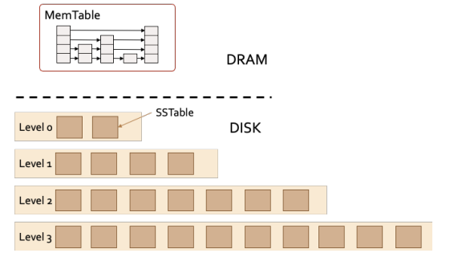
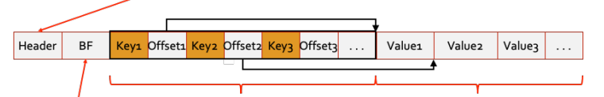

## Project LSM-KV: KVStore using Log-structured Merge Tree

- Explanation of each file:

```text
├── README.md // This readme file
├── correctness.cc // Correctness test
├── config
|    └── default.conf // default configuration file
├── kvstore.cc     // your implementation
├── kvstore.h      // your implementation
├── kvstore_api.h  // KVStoreAPI, you should not modify this file
├── skiplist.cc    // skiplist implementation
├── skiplist.h     // skiplist implementation
├── bloomfilter.cc // bloomfilter implementation
├── bloomfilter.h  // bloomfilter implementation
├── sstable.cc     // sstable cache implementation 
├── sstable.h      // sstable cache
├── global.cc      // memory and disk access functions
├── global.h       // memory and disk access functions
├── persistence.cc // Persistence test
├── utils.h        // Provides some cross-platform file/directory interface
├── MurmurHash3.h  // Provides murmur3 hash function
└── test.h         // Base class for testing
```

---

- LSM Tree(Log-structured Merge Tree) is a data structure that can perform a large number of write operations at a high performance, and the storage system is divided into two parts:
  memory storage and disk storage.
  
  The memory storage structure is called MemTable, which holds key-value pairs through a **Skiplist** data structure.
  The disk storage is stored in tiers, each of which contains multiple files, each called an SSTable(Sorted Strings Table), 
  for storing multiple key-value pairs in an ordered manner.
- The structure of each of SSTable file is divided into four parts: Header to store metadata; BloomFilter to quickly determine 
  whether a key value exists in the SSTable; Index area to store ordered index data; Data area to store data.
  
  Each tier of disk storage has a different maximum number of files, and in general, the higher the tier, the higher the maximum number files is present.
  In addition, each tier can be in **Tiering** mode or **Leveling** mode. Tiering mode tiers allow intersection of zones, where two files can contain keys
  in the range 0~100 and 1~101 respectively. Leveling mode tiers need to ensure that the key zones of any two different files do not intersect.
- When modifying or deleting, only one new record with the same key can be added to the system to represent the corresponding modification or deletion operation. Therefore a key may correspond to multiple records in the system.
  To distinguish them, a timestamp can be added to each entry.
- In order to maintain data consistency and provide efficient read operations, LSM Tree needs to perform **compaction** periodically. The compaction has three main steps: SSTable selection, SSTable compaction, and recursive checking.
  In Tiering mode, the key ranges between SSTable files can overlap; in Leveling mode, the key ranges between SSTable files cannot overlap.
  1. Select SSTables
     - If level-x is Tiering, select all files in level-x; if it is Leveling, the files with the smallest timestamps are selected first, so that the number of files meets the number of layers requirement.
     - If level-(x+1) is Tiering, no files would be selected; if it is Leveling, the min and max keys of selected files in level-x are counted first. All SSTable files in level-(x+1) with key ranges that overlap with [min, max] are selected. 
  2. Merge SSTable
     - Read all the above selected SSTable files into memory for merging and the result is divided into a new SSTable file for every 2MB and write to level-(x+1).
  3. Recursive checking
     - If the number of files in level-(x+1) exceeds the limit after the above steps, continue merging to the next level.